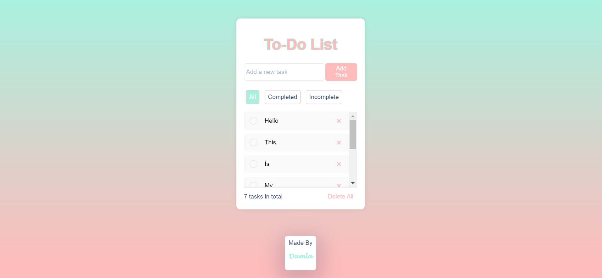
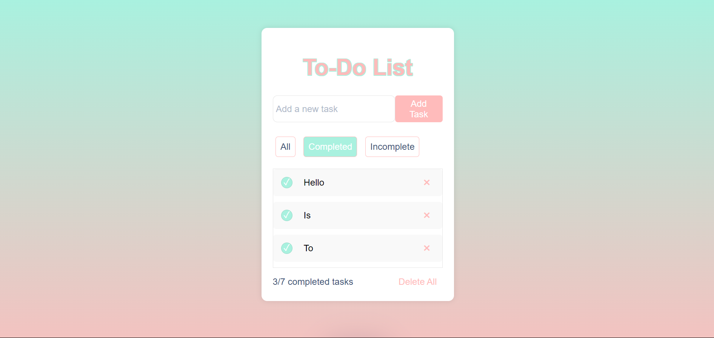
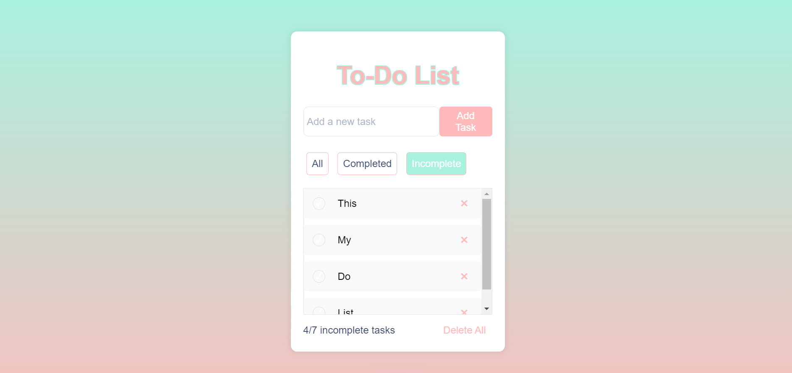

# Todo List Web Application

A simple, interactive to-do list application where users can add, mark as complete, and delete tasks. This app provides filtering options to display all tasks, only completed tasks, or only incomplete tasks.

## Features
- **Add Tasks**: Create new tasks that are displayed in the list.
- **Mark as Complete**: You can toggle a task's completion status using checkboxes.
- **Delete Tasks**: Each task has a delete button to remove it from the list.
- **Filter Tasks**: Use filter buttons to display all tasks, only completed tasks, or only incomplete tasks.
- **Persistent Storage**: Tasks are saved in local storage so they persist across browser sessions.

## Screenshots

### All Tasks


### Completed Tasks


### Incomplete Tasks


## How to Use

1. **Add Tasks**: Enter a task in the input field and press `Enter` or click `Add Task`.
2. **Mark as Complete**: Click on the checkbox to mark a task as complete or incomplete.
3. **Filter Tasks**: Use the `All`, `Completed`, or `Incomplete` buttons to filter your tasks.
4. **Delete Tasks**: Use the `x` button next to any task to delete it.

## Getting Started

To get started with the project:
1. Clone the repository:
    ```bash
   git clone https://github.com/megamiii/TodoList.git
    ```
2. Navigate to the project directory:
    ```bash
    cd TodoList
    ```
3. Open index.html in your preferred web browser:
    ```bash
    open index.html
    ```
## Folder Structure
```
/TodoList
  /assets
    all.png
    completed.png
    incomplete.png
  index.html
  styles.css
  app.js
  README.md
  ```